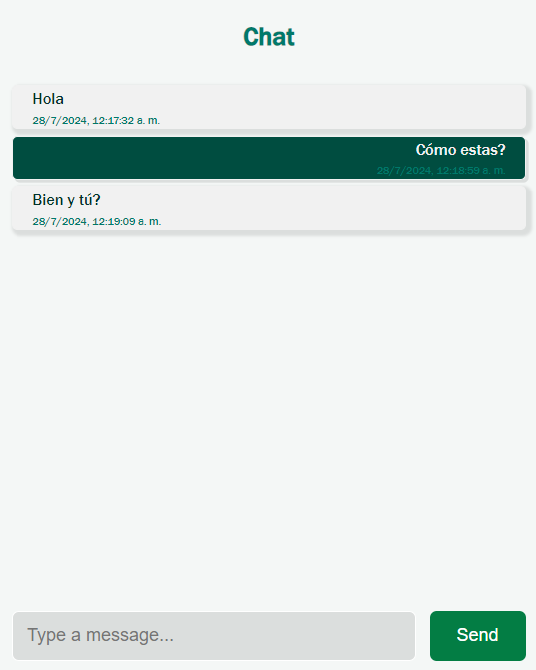

# ChatApp

ChatApp is a real-time chat application built with TypeScript, Express, Node.js, Socket.IO, and Postgre. The application uses Nodemon for development and dotenv for environment variable management.

## Technologies Used

- **TypeScript**: A typed superset of JavaScript that compiles to plain JavaScript.
- **Express**: A minimal and flexible Node.js web application framework.
- **Node.js**: JavaScript runtime environment.
- **Socket.IO**: Library for real-time web applications.
- **Postgre**: Relational database management system.
- **Nodemon**: Tool for automatically restarting the server during development.
- **dotenv**: Module to load environment variables from a `.env` file.

## Prerequisites

- Node.js and npm installed.
- Postgre configured and running.

## Installation

1. Clone the repository:
   ```bash
   git clone https://github.com/your_username/chatapp.git
Navigate to the project directory:

cd chatapp
Install dependencies:

npm install
Set up environment variables:
Create a .env file at the root of the project with the following variables:

DB_HOST=your_database_host
DB_USER=your_database_user
DB_PASSWORD=your_database_password
DB_NAME=your_database_name
DB_PORT=your_database_port
Database Setup
Install Postgre: If Postgre is not installed, download and install it from the official Postgre website.

Create a Database:

Open your terminal and access the Postgre command line interface (p) or use a graphical tool like pgAdmin.
Create a new database with the command:


CREATE DATABASE chatapp;
Create Tables:

Connect to the newly created database:

\c chatapp
Create the necessary tables. For example:


CREATE TABLE messages (
  message_id SERIAL PRIMARY KEY,
  content VARCHAR(255) NOT NULL,
  message_time TIMESTAMP DEFAULT CURRENT_TIMESTAMP
);
Configure Database Connection:

Use the pg library to connect to the Postgre database. Here's an example configuration:
typescript

import { Pool } from 'pg';
import dotenv from 'dotenv';

dotenv.config();

const pool = new Pool({
  host: process.env.DB_HOST,
  user: process.env.DB_USER,
  password: process.env.DB_PASSWORD,
  database: process.env.DB_NAME,
  port: parseInt(process.env.DB_PORT || '5432', 10),
});


Usage
Development
To start the server in development mode with automatic reloads:


npm run dev

Production
To start the server in production mode:


npm run start

Features
Real-time messaging: Users can send and receive messages in real-time.
WebSocket Events

Connection: Establish a connection with the server.

Message: Send and receive messages.

Disconnect: Handle disconnection from the server.

Client Connection
The client connects to the application via the root route at http://localhost:<port>/. This route serves an HTML page where the client can send and receive messages.

Contributions
Contributions are welcome. Please open an issue or submit a pull request.

